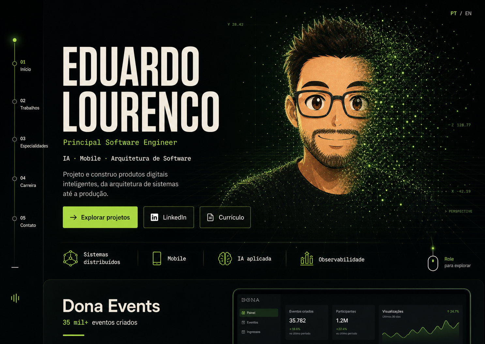

# Portfólio futurista com experiência 3D

Data: 2026-07-14
Status: aguardando aprovação final da especificação

## Relação com a especificação anterior

Este documento substitui a direção visual **Cosmic Intelligence** e a estação
orbital descritas na especificação de 2026-07-12. Permanecem válidos os
contratos já implementados de conteúdo bilíngue, Dona Events, URLs canônicas,
SEO, fallback progressivo, hospedagem estática e separação entre HTML e WebGL.
Em caso de conflito visual ou de runtime 3D, este documento prevalece.

## Direção aprovada

A implementação seguirá a direção visual 2, **Constructed Reality**:
composição editorial assimétrica, tipografia de alto contraste, verde
fosforescente controlado, navegação vertical no desktop e o retrato se
dissolvendo em um campo tridimensional de partículas.



A referência ao universo de Matrix será atmosférica, não literal. A interface
usará profundidade digital, sinais verdes, grids de perspectiva e tipografia
monoespaçada auxiliar, sem copiar marcas, personagens, glifos ou composições do
filme.

## Objetivos

- Comunicar senioridade de Principal Software Engineer nos primeiros segundos.
- Dar protagonismo a arquitetura, sistemas distribuídos, IA, mobile e
  observabilidade sem parecer um dashboard ou site de jogos.
- Entregar uma animação de partículas R3F memorável, mas subordinada ao conteúdo.
- Preservar HTML semântico, navegação por teclado, locales, SEO e funcionamento
  completo sem WebGL.
- Reduzir acoplamento entre layout, conteúdo, navegação e runtime gráfico.

## Fora de escopo

- Trocar React, Vite, i18next ou React Router.
- Adicionar CMS, backend, analytics ou novas integrações.
- Modelos 3D pesados, física, áudio, controles orbitais ou interação do usuário
  com a cena.
- Reescrever o conteúdo profissional ou inventar novas métricas.
- Reproduzir a identidade visual protegida de Matrix.

## Sistema visual

### Paleta e superfícies

- Fundo principal: preto esverdeado, próximo de `#020503`.
- Texto principal: branco quente; texto secundário: cinza mineral.
- Acento único: verde fosforescente em três intensidades.
- Ciano atual será removido da superfície principal.
- Superfícies serão separadas primeiro por espaçamento, linhas e contraste.
  Painéis translúcidos e sombras ficarão restritos a casos funcionais.

### Tipografia

- Display grotesco condensado para nome e títulos editoriais.
- Fonte monoespaçada somente para metadados, índices, status e labels.
- A fonte de display será um arquivo WOFF2 latino autocontido e pré-carregado;
  não haverá requisição a Google Fonts ou outro provedor no runtime.
- Texto corrido entre 16 e 18 px, largura máxima de 65 caracteres.
- O `h1` continuará contendo nome e cargo de forma semanticamente completa,
  ainda que o layout os apresente em linhas visuais diferentes.

### Layout responsivo

- Desktop: rail vertical fixo com seções numeradas; seletor de idioma no topo
  direito; hero em duas zonas assimétricas.
- Tablet: rail reduzido a indicadores e hero com proporção equilibrada.
- Mobile: header compacto, hero em uma coluna, retrato abaixo do texto e efeitos
  3D reduzidos ou substituídos pelo fallback estático.
- O layout respeitará `100svh`, safe areas, zoom de 200% e largura mínima de
  320 px.

## Experiência por seção

### Hero

- Nome em escala editorial, cargo e disciplinas imediatamente legíveis.
- CTA primário para trabalhos, secundário para LinkedIn e download de currículo
  como ação silenciosa.
- Retrato real permanece como `` responsiva e prioritária.
- Uma máscara CSS dissolve a lateral direita do retrato; o campo R3F ocupa a
  mesma zona visual, criando continuidade sem tornar a imagem dependente do
  canvas.
- Grids e chuva digital aparecem apenas no plano distante e com baixa opacidade.

### Trabalho em destaque

- Dona Events será uma faixa editorial ampla, não um dashboard fictício.
- `35 mil+ eventos criados` permanece como a única métrica principal.
- A rota de detalhe existente será reestilizada com os mesmos tokens, sem mudar
  contrato, conteúdo ou URLs canônicas.

### Especialidades, carreira e contato

- Especialidades deixam de parecer cards independentes e passam a formar um
  sistema de três colunas conectado por linhas e índices.
- Carreira mantém a linha temporal, agora tratada como um fluxo de sinal.
- Contato vira um encerramento direto e de alto contraste, sem simular terminal
  interativo.

## Arquitetura de componentes

```text
src/
├── components/navigation/
│   ├── DesktopSectionRail.tsx
│   └── MobileSiteHeader.tsx
├── features/home/
│   ├── HomePage.tsx
│   ├── HomeHero.tsx
│   └── HeroPortrait.tsx
├── experience/
│   ├── ParticleExperience.tsx
│   ├── ParticleScene.tsx
│   ├── particles/
│   │   ├── NeuralParticleField.tsx
│   │   ├── particle-shaders.ts
│   │   └── particle-layout.ts
│   ├── quality.ts
│   └── useExperienceGate.ts
└── styles/
    ├── tokens.css
    ├── base.css
    ├── layout.css
    └── components.css
```

Responsabilidades:

- `HomePage` compõe seções e não conhece detalhes de WebGL.
- `HeroPortrait` controla imagem, fallback, máscara e estado de carregamento.
- `ParticleExperience` decide se e quando o chunk 3D pode ser carregado.
- `ParticleScene` configura câmera, fog, luz e ciclo de vida do renderer.
- `NeuralParticleField` mantém geometria, uniforms e animação em uma chamada de
  desenho.
- `particle-layout` produz buffers determinísticos e testáveis, sem depender do
  React.
- Navegação desktop e mobile compartilha os contratos de rota existentes.
- CSS será dividido por responsabilidade; tokens não importarão componentes.

`CosmicStation` e o controlador de câmera atual serão removidos depois que a
nova experiência estiver coberta por testes. Não existirão dois runtimes 3D em
produção.

## Runtime 3D, performance e latência

- Um único `<Canvas>` e um único loop `requestAnimationFrame`.
- Partículas renderizadas com `THREE.Points`, `BufferGeometry` e shader, em uma
  chamada de desenho. Nenhum `setState` ocorrerá por frame.
- Perfis iniciais: 0 partículas no fallback, até 3.000 no mobile e até 9.000 no
  desktop. Os números só aumentam com medição real.
- DPR limitado a 1 no mobile e 1,5 no desktop; bloom será removido inicialmente.
- O chunk Three/R3F continuará isolado e será solicitado após o conteúdo
  crítico, usando idle scheduling com timeout limitado.
- `Save-Data`, `prefers-reduced-motion`, falta de WebGL e dispositivos de baixa
  memória usam fallback estático sem baixar o runtime 3D quando detectável.
- `IntersectionObserver` e `document.visibilityState` pausam o loop fora da
  viewport ou com a aba oculta.
- Buffers, materiais, observers e listeners serão liberados no unmount.

Budgets de aceitação:

- Nenhum aumento no chunk principal da aplicação acima de 10 kB gzip.
- A nova fonte WOFF2 deve permanecer abaixo de 50 kB e usar `font-display: swap`.
- Nenhuma nova dependência de runtime sem justificativa medida.
- CLS do hero deve permanecer zero em desktop e mobile.
- O canvas não pode bloquear leitura ou interação dos CTAs.
- Meta de renderização: 55–60 FPS em desktop representativo e pelo menos 30 FPS
  no perfil mobile médio; se o piso falhar, reduz-se densidade antes de efeitos.

## Concorrência e throughput

O sistema continua estático e servido por CDN; o throughput de backend não se
altera. A concorrência relevante permanece no cliente:

- download e parse do chunk 3D não competem com HTML, CSS, foto e fontes críticas;
- geração de buffers acontece uma vez e seus resultados são memorizados;
- o loop de renderização atualiza somente uniforms e matrizes na GPU;
- scroll, observers e eventos de visibilidade não disparam trabalho pesado em
  paralelo;
- não haverá workers nesta etapa: o volume de preparação não justifica custo de
  transferência e complexidade operacional.

## Falhas e resiliência

- Erro de importação, criação do contexto ou renderização WebGL ativa o
  fallback estático sem remover conteúdo ou CTAs.
- `webglcontextlost` interrompe o loop; a experiência não tentará recriações
  infinitas.
- A foto possui fallback visual e dimensões reservadas.
- Falha de locale continua recaindo para inglês conforme o contrato atual.
- Deep links, 404 e as quatro URLs canônicas permanecem inalterados.
- A cena é `aria-hidden`, não captura ponteiro e não participa da ordem de foco.

## Fluxo de dados

1. `AppRouter` resolve locale e conteúdo.
2. `HomePage` renderiza imediatamente toda a estrutura HTML.
3. `HeroPortrait` carrega a imagem prioritária com dimensões reservadas.
4. `useExperienceGate` avalia preferências, capacidade, visibilidade e idle.
5. Apenas no perfil elegível, `ParticleExperience` importa R3F e monta a cena.
6. Scroll e visibilidade alteram apenas intensidade e execução do canvas; o
   conteúdo React não é re-renderizado por frame.

## Testes e validação

- Unitários para seleção de qualidade, gating, buffers determinísticos e
  fallbacks.
- Testes de componentes para semântica do hero, navegação desktop/mobile,
  locale, teclado e falha do canvas.
- E2E nas rotas canônicas em desktop e mobile, com WebGL disponível e bloqueado.
- Capturas visuais em 1440 x 1024, 834 x 1194 e 390 x 844 comparadas com a
  referência aprovada.
- `npm run check` e `npm run e2e` permanecem gates obrigatórios.
- Build registrará tamanhos dos chunks antes e depois; profiling confirmará FPS,
  tempo de frame e ausência de recursos GPU retidos.

## Critérios de aceitação

- A home reproduz a hierarquia, o contraste e a dissolução de partículas da
  direção 2 sem sacrificar legibilidade.
- Conteúdo e ações essenciais funcionam com JavaScript parcial e sem WebGL.
- Os dois locales mantêm paridade estrutural e nenhuma string fica hardcoded.
- Navegação por teclado, foco visível e movimento reduzido passam nos testes.
- Não existem loops, canvases ou geometrias duplicadas.
- A rota Dona Events e o 404 recebem o mesmo sistema visual sem regressão de
  contrato.
- Os budgets definidos acima são medidos e documentados no handoff.

## Decisões explícitas

- A opção 2 é o alvo visual oficial.
- A foto permanece no DOM; partículas complementam a dissolução.
- A experiência 3D é progressiva e nunca é requisito para consumir o portfólio.
- O runtime gráfico atual será substituído, não mantido em paralelo.
- Performance degradada resolve-se reduzindo densidade e efeitos, não removendo
  conteúdo ou interações.
